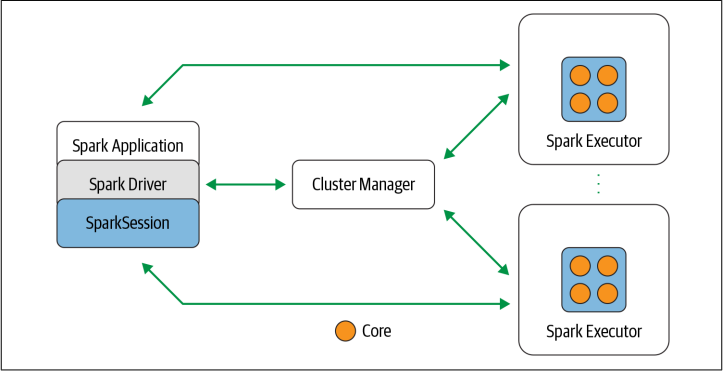

<style>body {text-align: justify}</style>

Hãy bắt đầu bằng cách nhìn từng thành phần của Spark trong ảnh.
\
\


### Spark Driver
Là một phần của Spark application chịu trách nhiệm cho việc khởi tạo SparkSession.
Spark Driver có nhiều vai trò như:
- Giao tiếp với cluster manager.
- Gửi yêu cầu sử dụng tài nguyên (CPU, memory,...) từ cluster manager cho Spark's Executor (JVMs).
- Chuyển đổi spark operations thành DAG computations, schedules (tính toán, lên lịch).

### Spark Session
Kể tử Spark 2.0, SparkSession được coi như là cách kết nối thống nhất đến tất cả các hoạt động của Spark và dữ liệu.
Gộp các entrypoint cũ như SparkContext, SQLContext, HiveContext, SparkConf và StreamingContext. Khiến việc sử dụng Spark trở nên dễ dàng hơn.
\
\
Tức là kể từ giờ SparkSession là entrypoint cho tất cả các tính năng của Spark.
\
\
**Ví dụ:** Dưới đây là một ví dụ về việc sử dụng SparkSession và thực hiện một số hoạt động truy vấn dữ liệu.

```scala
// In Scala
import org.apache.spark.sql.SparkSession

// Build SparkSession
val spark = SparkSession
    .builder
    .appName("LearnSpark")
    .config("spark.sql.shuffle.partitions", 6)
    .getOrCreate()

// Sử dụng session để đọc file JSON
val people = spark.read.json("...")

// Sử dụng sesion để truy vấn một query và lưu thành DataFrame
val resultsDF = spark.sql("SELECT city, pop, state, zip FROM table_name")
```

### Cluster Manager
Cluster Manager chịu trách nhiệm cho việc quản lý và phân bố tài nguyên cho cụm các node cho Spark.
Hiện tại, Spark hỗ trợ 4 cluster managers:
- cluster managers được tích hợp sẵn trong Spark.
- Apache Hadoop YARN
- Apache Mesos
- Kubernetes

### Spark Executor
Spark Executor chạy trên từng worker node trong cụm. Spark Executor giao tiếp với Spark Driver và chịu trách nhiệm cho việc thực thi các nhiệm vụ trên các worker.
\
\
Trong hầu hết các chế độ triển khai (Deployment modes), chỉ có một executor trên một node.

### Deployment modes
Hỗ trợ nhiều chế độ triển khai, giúp Spark chạy trên các configurations và environments khác nhau.
\
\
Một số môi trường phổ biến như Apache Hadoop Yarn và Kubernetes và có thể hoạt động trên nhiều chế độ.


### Distributed data and partitions

Dữ liệu vật lý thực tế được phân phối trên bộ lưu trữ dưới dạng các phân vùng (partitions) nằm trong HDFS hay cloud storage.
\
\
Trong khi dữ liệu được phân phối thành các partitions trên các cụm vật lý (physical cluster). Spark xử lý từng partition dưới dạng trừu tượng dữ liệu logic cấp cao - như một DataFrame trong bộ nhớ.


Việc phân vùng dữ liệu giúp cho hiệu suất xử lý song song hiệu quả.
Việc này giúp cho Spark Executor chỉ xử lý dữ liệu gần với chúng nhất, giảm thiểu băng thông mạng.


**Ví dụ:** Đoạn code sau đây sẽ chuyển đổi dữ liệu vật lý lưu trên clusters thành 8 partition, và từng executor sẽ có một hoặc nhiều partitions để đọc vào memory.

```python
# In Python
log_df = spark.read.text("path_to_large_text_file").repartition(8)
print(log_df.rdd.getNumPartitions())
```

**Ví dụ 2:** Đoạn code dưới đây sẽ tạo một DataFrame với 10000 số nguyên phân bố trên 8 partitions trong bộ nhớ:
```python
# In Python
df = spark.range(0, 10000, 1, 8)
print(df.rđ.getNumPartitions())
```

2 ví dụ trên đều có output là 8.
