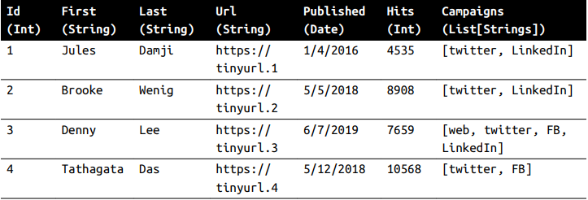

<style>body {text-align: justify}</style>

Spark DataFrame được lấy cảm hứng từ pandas DataFrame về cấu trúc, định dạng và một số thao tác cụ thể. Ví dụ về một Spark DataFrame được hiển thị tại Hình 1.


_Hình 1: Table-like format of a DataFrame_

DataFrame trong Spark bất biến và Spark giữ lại và theo dõi tất cả các transformations (Được nêu ở phần 4). Vì thế bạn có thể sửa đổi tên hoặc data types của cột, tạo DataFrame mới mà bản cũ vẫn được bảo tồn.

### Spark's Basic Data Types 
Những data types cơ bản có trong Python cũng được Spark hỗ trợ. Ví dụ như Hình 2 dưới đây.


\
_Hình 2: Basic Python data types in Spark_

### Spark's Structured and Complex Data Types
Để dùng cho những việc phân tích phức tạp, bạn không chỉ đối mặt với những kiểu dữ liệu cơ bản trên. Mà dữ liệu của bạn sẽ phức tạp hơn, thường có cấu trúc hoặc lồng nhau.
Vì vậy, bạn cần Spark có thể xử lý được những kiểu dữ liệu phức tạp đó. Có thể như: maps, arrays, structs, dates, timestamps, fields,...

Trong Python, các kiểu dữ liệu tương đương cũng được Spark hỗ trợ, ví dụ


_Hình 3: Python structured data in Spark_

### Schemas and Creating DataFrames

Một schema trong Spark xác định tên cột và liên kết với kiểu dữ liệu cho một DataFrame. Schema thường được sử dụng khi đọc dữ liệu có cáu trúc từ nguồn dữ liệu bên ngoài.
\
\
Tác dụng của Schema:
- Giúp Spark có thể tránh khỏi việc tự suy luận ra kiểu dữ liệu.
- Giúp Spark ngăn chặn việc tạo một công việc riêng để đọc một khối lượng lớn dữ liệu để xác định ra lược đồ (schema). Với một lượng dữ liệu lớn, điều này có thể gây tốn kém và tốn thời gian.
- Bạn có thể phát hiện lỗi sớm nếu dữ liệu không khớp với lược đồ (schema).

##### Có 2 cách để định nghĩa một schema

**Một là,** định nghĩa một cách rất lập trình (programmatically). \
**Hai là,** triển khai một DDL (Data Definition Language) String, cách này đơn giản và dễ đọc hơn.
\
\
Để định nghĩa một schema programmatically cho một DataFrame với 3 cột: author, title và pages, bạn có thể sử dụng Spark DataFrame API. Ví dụ:

``` scala
// In Scala
import org.apache.spark.sql.types._
val schema = StructType(Array(StructField("author", StringType, false),
                              StructField("title", StringField, false),
                              StructField("pages", IntegerType, false)))
```
```python
# In Python
from pyspark.sql.types import *
schema = StructType([StructField("author", StringType(), False),
                     StructField("title", StringType(), False),
                     StructField("pages", IntegerType(), False)])
```

Cách định nghĩa thứ 2 sử dụng DDL đơn giản hơn rất nhiều, ví dụ:
```scala
// In Scala
val schema = "author STRING, title STRING, pages INT"
```
```python
# In Python
schema = "author STRING, title STRING, pages INT"
```
Bạn có thể chọn cách định nghĩa schema tùy thích.

**Ví dụ:** Tạo SparkSession và xác định lược đồ và thêm dữ liệu vào trong DataFrame.
```python
# In Python
# Example-3_6.py
from pyspark.sql import SparkSession

# Xác định lược đồ của dữ liệu bằng DDL
schema = "`Id` INT, `First` STRING, `Url` STRING, `Published` STRING, `Hits` INT, `Campaigns` ARRAY<STRING>"

# Tạo static data
data = [[1, "Jules", "Damji", "https://tinyurl.1", "1/4/2016", 4535, ["twitter", "LinkedIn"]],
       [2, "Brooke","Wenig", "https://tinyurl.2", "5/5/2018", 8908, ["twitter","LinkedIn"]],
       [3, "Denny", "Lee", "https://tinyurl.3", "6/7/2019", 7659, ["web", "twitter", "FB", "LinkedIn"]],
       [4, "Tathagata", "Das", "https://tinyurl.4", "5/12/2018", 10568, ["twitter", "FB"]],
       [5, "Matei","Zaharia", "https://tinyurl.5", "5/14/2014", 40578, ["web", "twitter", "FB", "LinkedIn"]],
       [6, "Reynold", "Xin", "https://tinyurl.6", "3/2/2015", 25568, ["twitter", "LinkedIn"]]]

# Hàm chính
if __name__ == "__main__":
    # Khởi tạo SparkSession
    spark = (SparkSession
             .builder
             .appName("CreatingDataFrame")
             .getOrCreate())
    # Tạo một DataFrame bằng schema đã được định nghĩa 
    blogs_df = spark.createDataFrame(data=data, schema=schema)
    # Hiển thị DataFrame
    blogs_df.show()
    # Hiển thị schema
    print(blogs_df.printSchema())
```
Chạy chương trình trong console sẽ được output như sau:
```console 
$ spark-submit Example-3_6.py
...
+-------+---------+-------+-----------------+---------+-----+------------------+
|Id     |First    |Last   |Url              |Published|Hits |Campaigns         |
+-------+---------+-------+-----------------+---------+-----+------------------+
|1      |Jules    |Damji  |https://tinyurl.1|1/4/2016 |4535 |[twitter,...]     |
|2      |Brooke   |Wenig  |https://tinyurl.2|5/5/2018 |8908 |[twitter,...]     |
|3      |Denny    |Lee    |https://tinyurl.3|6/7/2019 |7659 |[web, twitter...] |
|4      |Tathagata|Das    |https://tinyurl.4|5/12/2018|10568|[twitter, FB]     |
|5      |Matei    |Zaharia|https://tinyurl.5|5/14/2014|40578|[web, twitter,...]|
|6      |Reynold  |Xin    |https://tinyurl.6|3/2/2015 |25568|[twitter,...]     |
+-------+---------+-------+-----------------+---------+-----+------------------+
root
|-- Id: integer (nullable = false)
|-- First: string (nullable = false)
|-- Last: string (nullable = false)
|-- Url: string (nullable = false)
|-- Published: string (nullable = false)
|-- Hits: integer (nullable = false)
|-- Campaigns: array (nullable = false)
| |-- element: string (containsNull = false)
```

### Columns and Expression
Có thể sử dụng biểu thức toán học, logic lên các cột. Ví dụ bạn có thể tạo một biểu thức cơ bản sử dụng _expr("ColumnName" * 5)_ hoặc _(expr("columnName") - 5 > col(anotherColumnName))_.
\
\
Câu lệnh expr() là một phần gói của _pyspark.sql.functions_ (Python) và _org.apache.spark.sql.functions_ (Scala). Câu lệnh này lấy đối số mà Spark có thể phân tích thành biểu thức và tính toán ra kết quả.

> **_NOTE:_**  Cả Scala, Java, Python đều có một phương thức public liên kết với cột. Trong Spark document đề cập đến col và Column. Column là tên của đối tượng, còn col() là một hàm để trả về một Column.

Bạn hãy xem ví dụ dưới đây để thấy được chúng ta có thể làm gì với cột trong Spark.

```scala 
// In Scala
scala> import org.apache.spark.sql.functions._
scala> blogsDF.columns
res2: Array[String] = Array(Campaigns, First, Hits, Id, Last, Published, Url)

// Truy cập một cột cụ thể và trả về loại Cột
scala> blogsDF.cols("Id")
res3: org.apache.spark.sql.Column = id

// Sử dụng biểu thức để tính toán
scala> blogsDF.select(expr("Hits * 2")).show(2)

// Hoặc sử dụng col() để tính toán giá trị cùng kết quả với câu lệnh trên
scala> blogsDF.select(col("Hits") * 2).show(2)

+----------+
|(Hits * 2)|
+----------+
| 9070     |
| 17816    |
+----------+

// Sử dụng biểu thức để tính toán những người nổi tiếng về blog
// Câu lệnh này sẽ tạo ra cột mới, tên "Big Hitters", dựa trên biểu thức điều kiện

blogsDF.withColumn("Big Hitters", (expr("Hits > 10000"))).show()

Output:
+---+---------+-------+---+---------+-----+--------------------+-----------+
| Id| First   | Last  |Url|Published| Hits| Campaigns          |Big Hitters|
+---+---------+-------+---+---------+-----+--------------------+-----------+
| 1 | Jules   | Damji |...| 1/4/2016| 4535| [twitter, LinkedIn]| false     |
| 2 | Brooke  | Wenig |...| 5/5/2018| 8908| [twitter, LinkedIn]| false     |
| 3 | Denny   | Lee   |...| 6/7/2019| 7659|[web, twitter, FB...| false     |
| 4 |Tathagata| Das   |...|5/12/2018|10568| [twitter, FB]      | true      |
| 5 | Matei   |Zaharia|...|5/14/2014|40578|[web, twitter, FB...| true      |
| 6 | Reynold | Xin   |...| 3/2/2015|25568| [twitter, LinkedIn]| true      |
+---+---------+-------+---+---------+-----+--------------------+-----------+
```
```scala
// Kết hợp 3 cột, tạo cột mới và hiển thị.
blogsDF
    .withColumn("AuthorsId", (concat(expr("First"), expr("Last"), expr("Id"))))
    .select(col("AuthorsId))
    .show(4)
Output:
+-------------+
| AuthorsId   |
+-------------+
| JulesDamji1 |
| BrookeWenig2|
| DennyLee3   |
|TathagataDas4|
+-------------+
```
```scala
// Những câu lệnh dưới đây cùng trả về chung giá trị:
blogsDF.select(expr("Hits")).show(2)
blogsDF.select(col("Hits")).show(2)
blogsDF.select("Hits").show(2)
```
```scala
// Sắp xếp giảm dần cột "Id"
blogsDF.sort(col("Id").desc).show()
blogsDF.sort($"Id".desc).show()
```
Trong ví dụ cuối, col("Id".desc) và $"Id".desc đều giống nhau. Đều sắp xếp cột có tên "Id" theo thứ tự giảm dần. Trong đó:
- col("Id") trả về một Column object
- Còn sử dụng $ trước tên cột sẽ chuyển đổi tên cột thành Column.

### Rows
