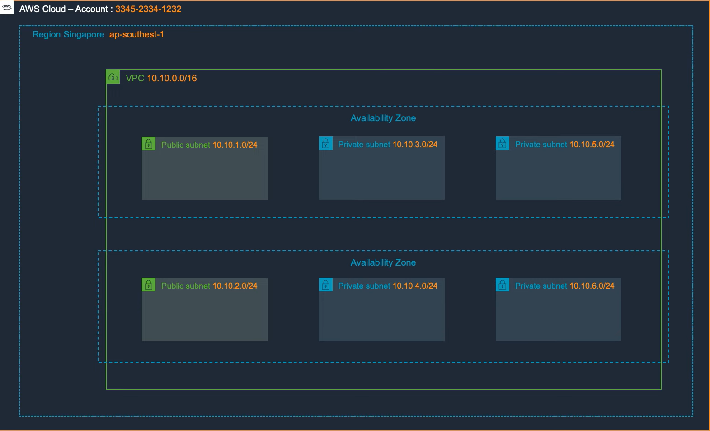
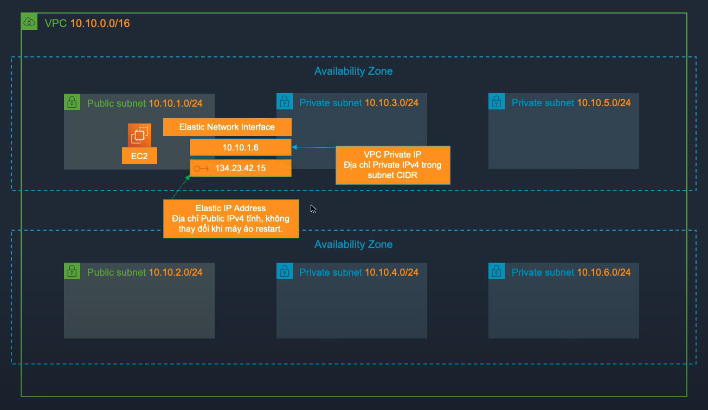

[//]: # ()

- Amazon Virtual Private Cloud (Amazon VPC) cho phép bạn khởi chạy các tài nguyên AWS vào một mạng ảo mà bạn đã xác định.
- VPC nằm trong 1 Region, khi tạo VPC cần khai báo 1 lớp mạng CIDR IPv4 (bắt buộc) và IPv6 (optional)
- Giới hạn của VPC hiện tại là 5 VPC trên 1 AWS Region trên 1 AWS Account.
- Mục đích chính sử dụng VPC thường dùng để phân tách các môi trường
  (Production / Dev / Test / Staging)
- Lưu ý: Nếu muốn các tài nguyên tách biệt hẳn (User không thể nhìn thầy một tài nguyên cụ thể thì cần tách thành nhiều AWS Account, nhiều VPC không giải quyết được vấn đề này)

### Amazon Virtual Private Cloud (VPC) - Subnet
- Amazon VPC cho phép tạo nhiều mạng ảo và chia các mạng ảo này thành các mạng con (subnet)
- VPC Subnet sẽ năm trong 1 Availability Zone cụ thể.
- Khi tạo Subnet, chúng ta chỉ định CIDR cho mạng con đó và đây là một tập hợp con của khối VPC CIDR
- Trong mỗi Subnet, AWS sẽ giữ 5 địa chỉ IP. Ví dụ nếu Subnet có CIDR là 10.10.1.0/24
  - Địa chỉ netwwork (10.10.1.0)
  - Địa chỉ broadcast (10.10.1.255)
  - Địa chỉ cho bộ định tuyến (10.10.1.1)
  - Địa chỉ cho DNS (10.10.1.2)
  - Địa chỉ cho tính năng tương lai (10.10.1.3)

### Amazon Virtual Private Cloud (VPC) - Route Table
- Route Table (Bảng định tuyến), tập hợp các Route, để xác định đường đi cho mạng.
- Khi tạo VPC, AWS sẽ tạo một Default Rote table, không thể bị xóa và chỉ chứa 1 Route duy nhất là Route cho phép tất cả các Subnet trong VPC liên lạc với nhau.
- Route table sẽ được gắn vào Subnet
- Chúng ta có thể tạo Custom Route table, tuy nhiên sẽ không thể xóa default route (VPC CIDR - local).

### Amazon Virtual Private Cloud (VPC) - Elastic Network Interface (ENI)
- Elastic Network Interface (ENI) là một card mạng ảo, chúng ta có thể chuyển sang các EC2 Instance khác.
- Khi chuyển sang một máy chủ mới, một card mạng ảo sẽ vẫn duy trì:
  - Địa chỉ IP Private
  - Địa chỉ Elastic address
  - Địa chỉ MAC

### Amazon Virtual Private Cloud (VPC) - Elastic IP address (EIP)
- Elastic IP address (EIP) là một địa chỉ public IPv4 tĩnh, có thể liên kết với một Elastic Network Interface.
- Khi không sử dụng, sẽ bị charge phí (tránh lãng phí)

Khi tạo một EC2 Instance, sẽ tạo ra một Elastic Network Interface bao gồm
- VPC Private IP, Địa chỉ Private IPv4 trong subnet CIDR. Ví dụ trong ảnh Public Subnet với dải CIDR 10.10.1.0/24 thì EC2 sẽ được gán trong khoảng từ 10.10.1.4 -> 10.10.1.254. Trường hợp trong ảnh là 10.10.1.6
- Elastic Ip Address, Địa chỉ Public IPv4 tĩnh, không thay đổi khi máy ảo restart. Trong ảnh là 134.23.42.15

### Amazon Virtual Private Cloud (VPC) - VPC Endpoint
- VPC Endpoint cho phép chúng ta kết nối các tài nguyên nằm trong VPC tới các dịch vụ AWS được hỗ trợ (AWS PrivateLink - đi qua mạng private của AWS) mà không cần thông qua kết nối internet.
- Có 2 kiểu VPC Endpoint:
  - Interface Endpoint: Sử dụng một Elastic Network Interface trong VPC cùng với một địa chỉ IP Private để kết nối tới một dịch vụ hỗ trợ.
  - Gateway Endpoint: Sử dụng một route table để định tuyến tới endpoint của dịch vụ hỗ trợ (S3 và DynamoDB)

### Amazon Virtual Private Cloud (VPC) - Internet Gateway
- Internet Gateway là một thành phần của Amazon VPC có khả năng mở rộng quy mô theo chiều nang (scale out) cho phép các EC2 Instance trong VPC có thể truyền thông tin ra ngoài Internet.
- Internet Gateway được quản lý bởi AWS, chúng ta không cần cấu hình autosclae hoặc high availability.

### Amazon Virtual Private Cloud (VPC) - NAT Gateway
- NAT gateway cho phép các EC2 instance trong subnet truy ập tới interrnet hoặc các dịch vụ AWS khác. Chỉ chấp nhận kết nối chiều ra và không chấp nhận kết nối chiều vào.

