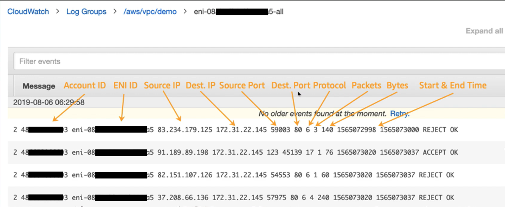

### Amazon Virtual Private Cloud (VPC) - Security Group
- Security Group (SG) là một tường lửa ảo có lưu trữ trạng thái (stateful) giúp kiểm soát lượng truy cập đến và đi trong tài nguyên của AWS.
- Security Group rule được hẹn chế theo giao thức, địa chỉ nguồn, cổng kết nối, hoặc một Security Group khác.
- Security Group rule chỉ cho phép rule allow.
- Security Group được áp dụng lên các Elastic Network Interface.

### Amazon Virtual Private Cloud (VPC) - Network Access Control List (NACL)
- Network Access Control List (NACL) là một tường lửa ảo không lưu trữ trạng thái (stateless) giúp kiểm soát lượng truy cập đến và đi trong tài nguyên của AWS
- NACL được hạn chế theo giao thức, địa chỉ nguồn, cổng kết nối.
- NACL được áp dụng lên các Amazon VPC Subnets.
- Mặc định NACL cho phép mọi truy cập đến và đi.

### Amazon Virtual Private Cloud (VPC) - VPC Flow Logs
- VPC Flow Logs là một tính năng cho phép bạn nắm bắt thông tin về lưu lượng IP đến và đi từ các giao diện mạng trong VPC của bạn.
- Các tập tin logs có thể được xuất bản lên Amazon CloudWatch Logs hoặc Amazon S3.
- VPC Flow Logs không capture nội dung gói tin.

### VPC Peering
- VPC Peering là tính năng giúp kết nối hai hay nhiều VPC để các tài nguyên bên trong hai VPC đó có thể liên lạc trực tiếp với nhau không cần phải thông qua Internet, góp phần gia tăng tính bảo mật cho VPC.
- VPC Peering là kết nối cần tạo 1:1 giữa hai VPC thành viên, không hỗ trợ transitive routing.
- VPC Peering không hỗ trợ khi 2 VPC bị overlap IP address space.

### Transit Gateway
- Transit Gateway được dùng để kết nối các VPC và mạng on-premises thông qua một hub trung tâm. Điều này đơn giản hóa mạng và kết thúc các mối quan hệ định tuyến phức tạp.
- Transit Gateway Attachment là một công cụ để gán các subnet của từng VPC cần kết nối với nhau vào một TGW đã được khởi tạo. Transit Gateway Attachment hoạt động ở quy mô AZ-level.
- Trong VPC, khi một subnet ở một AZ có Transit Gateway Attachment với một TGW, các subnet khác trong cuùng AZ đều có thể kết nối với TGW đó.
