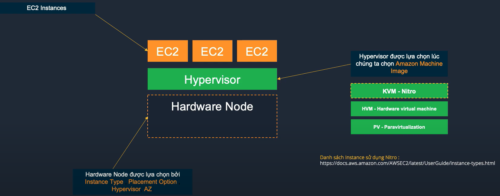
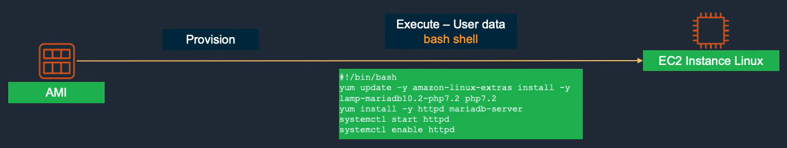

Amazon EC2 giống với máy chủ áo hoặc máy chủ vật lý truyền thống.

Có khả năng:
- khởi tạo nhanh
- khả năng co dãn tài nguyên mạnh mẽ
- linh hoạt

Amazon EC2 có thể hỗ trợ workload như lưu trữ web, ứng dụng, cơ sở dử liệu và bất cứ công việc nào khác mà máy chủ thông thường có thể đáp ứng.

Cấu hình của Amazon EC2 không được tùy chọn tùy ý, mà lựa chọn thông qua các EC2 Instance Type sẽ quyết định:
- CPU (Intel / AMD / ARM (Graviton 1/2/3) / GPU )
- Memory
- Network
- Storage

### AMI / Backup / Key Pair

- Sử dụng AMI (Amazon Machine Image) có thể provision ra một hoặc nhiều EC2 Instances cùng lúc.
AMI có sẵn của AWS, trên AWS Market Place và custom AMI tự tạo từ EC2
- AMI bao gồm root OS volumes, quyền sử dụng AMI quy định tài khoản AWS được sử dụng và mapping EBS volume sẽ được tạo và gán vào EC2 Instances
- EC2 Instance có thể được backup bằng cách tạo snapshot.
- Key pair (public key và private key) dùng để mã hóa thông tin đăng nhập cho EC2 Instance.

### Elastic Block Store
- Amazon EBS cung cấp block storage và được gán trực tiếp vào EC2 Instance, tuy được gán trực tiếp như một RAW device, EBS về bản chất hoạt động độc lập với EC2 và được kết nối thông qua mạng riêng của EBS.
- EBS ó 2 nhóm đĩa chính là HDD và SSD, được thiết kế để đạt độ sẵn sàng 99.999% bằng cách replicate dữ liệu giữa 3 Storage Node trong 1 AZ
- Có một số EC2 Instances đặc thù được tối ưu hóa hiệu năng EBS (Optimized EBS Instances)
- EBS volumes, mặc định chỉ được gán vào 1 EC2 Instance, EC2 Instances chạy trên **Hypervisor Nitro** có thể dùng 1 EBS volume gắn vào nhiều EC2 Instances. (EBS Multi attach)
- EBS được backup bằng cách thực hiện snapshot vào S3 (Simple Storage Service)
  - Snapshot đầu tiên là full, tất cả các snapshot tiếp theo là incremental.

### Instance Store
- Instance store là vùng đĩa NVME tốc độ cực cao, nằm trên physical node chạy các máy ảo EC2.
  - Instance store sẽ bị xóa hết dữ liệu khi chúng ta thực hiện stop EC2 Instance
  - Instance store sẽ không bị xóa dữ liệu khi thực hiện restart máy hoặc bị crash.
  - Instance store không replicate dữ liệu dự phòng nên thường không khuyến khích lưu trữ dữ liệu quan trọng.
    - Sử dụng dữ liệu trong các trường hợp cần hiệu năng cực cao lên tới hàng triệu IOPS.
      - Khi sử dụng thường được replicate dữ liệu vào một EBS volume để đảm bảo an toàn.

### User Data
- EC2 user data là đoạn script chạy 1 lần khi provision EC2 Instance từ AMI.
- Tùy hệ điều hành mà sẽ sử dụng shell scripts (Linux) / powershell (Windows)

### EC2 Metadata
- EC2 Metadata là các thông tin liên quan đến bản thân EC2 instances, ví dụ địa chỉ IP Private, Public, Hostname, Security groups...
- Dùng thông tin EC2 Metadata để thiết lập hostname cho EC2 Instance Linux với EC2 user data.

### EC2 Auto Scaling
- EC2 Auto Scaling alf tính năng hỗ trợ tăng giảm số lượng EC2 Instance dựa theo các điều kiện cụ thể (scaling policy)
- EC2 Auto Scaling có thể tự đăng ký các EC2 Instance vào Elastic Load Balancer
- EC22 Auto Scaling hoạt động trên nhiều AWS Availability Zone
- EC2 Auto Scaling có thể hỗ trợ nhiều Pricing options khác nhau.

### EC2 Auto Scaling - EPS/FSx - Lightsail - MGN

#### EC2 Pricing Options
Bao gồm 4 tùy chọn giá:
1. On-demand Trả theo giờ / phút / giây, xài nhiêu tính nhiêu, mắc nhất. Phù hợp cho các workload chạy lên tới 6 tiếng 1 ngày.
2. Reserved Instance: Cam kết sử dụng theo kì hạn 1-3 năm để lấy discount, tuy nhiên bị giới hạn theo EC2 Instance type/ family
3. Saving Plans: Cam kết sử dụng theo kì hạn 1-3 năm để lấy discount, có thể không bị giới hạn bởi EC2 Instance type family.
4. Spot Instance: Tận dụng tài nguyên dư, giá rẻ tuy nhiên khi cần thì AWS sẽ terminate instance trong 2 phút.

Kết hợp nhiều Pricing Options trong EC2 Auto Scaling Group.

#### Amazon Lightsail
- Amazon Lightsail là dịch vụ tính toán có chi phí thấp (giá tính theo tháng chỉ bắt đầu từ 3.5 $ / tháng) ngoài ra mỗi Instance Lightsail tạo ra sẽ có một mức data transfer đi kèm (data transfer này có mức giá rẻ hơn data transfer từ EC2 tương đối nhiều)
- Phù hợp cho các workload nhẹ, môi trường test dev, không yêu cầu tải CPU cao liên tục > 2h mỗi ngày.
- Có khả năng backup bắng snapshot tương tự EC2.
- Chạy trong VPC đặc biệt, có thể kết nối tới VPC thông thường qua VPC Peering.

#### Amazon EFS
- EFS (Elastic File System) cho phép tạo các NFSv4 Network volume và gán vào nhiều EC2 Instance cùng lúc, quy mô lưu trữ đến hàng petrabyte. EFS chỉ support Linux.
- Chi phí hteo dung lượng sử dụng (trong khi EBS tính phí theo dung lượng ấp phát).
- EFS có thể được cấu hình để mount vào môi trường on-premise qua DX hoặc VPN.

#### Amazon FSX
- FSx cho phép tạo các NTFS volume và gán vào nhiều EC2 Instances cùng lúc sử dụng giao thức SMB (Server Message Block), FSx support Windows và Linux
- Sử dụng FSx chỉ tính phí theo dung lượng sử dụng.
- FSx hỗ trợ tính năng deduplication, giúp giảm chi phí 30-50% cho các trường hợp sử dụng thông thường.

#### AWS Application Migration Servie (MGN)
- AWS Application Migration Service (MGN) dùng để migrate và replicate phục vụ mục đích xây dựng Disaster Recovery Site cho các máy chủ thực, ảo lên môi trường AWS.
- MGN liên tục sao chép các máy chủ nguồn sang EC2 Instance trên tài khoản AWS (asynchronous / synchronous)
- MGN trong quá trình sao chép sẽ sử dụng các máy staging có số lượng và quy mô cấu hình nhỏ hơn máy chủ gốc rất nhiều.
- Khi thực hiện cut-over MGN sẽ tự động tạo và chạy các máy chủ EC2 tren AWS.